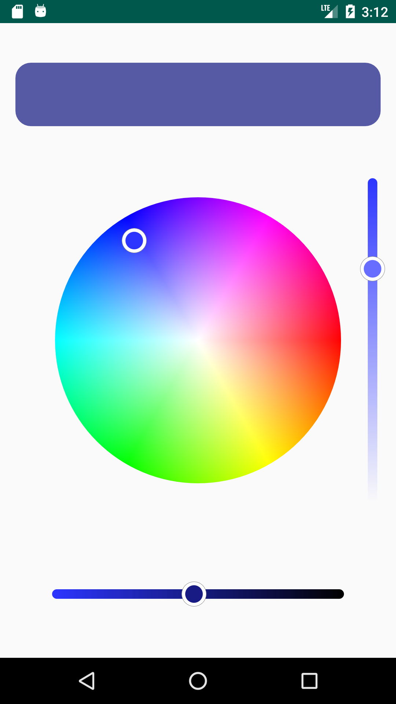
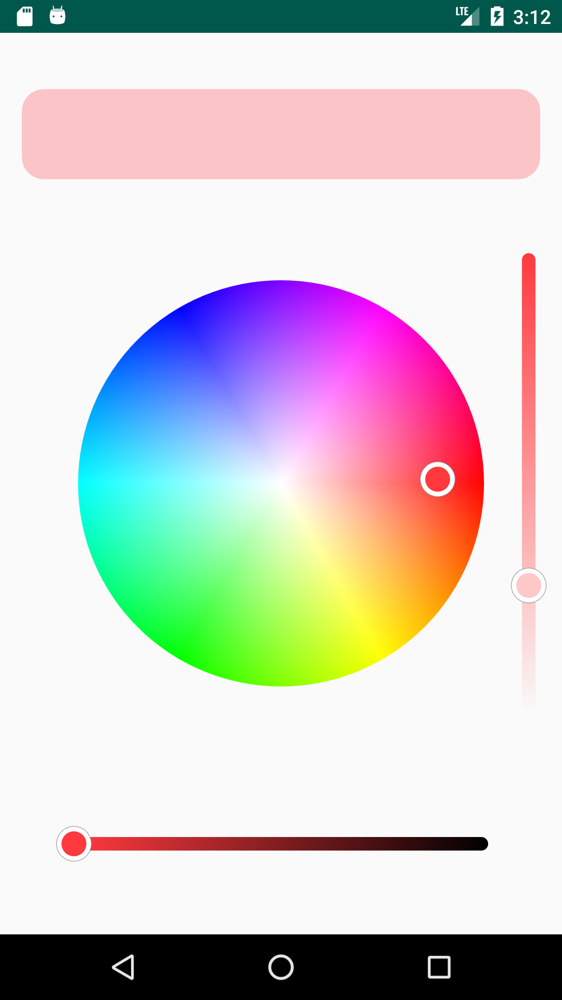

# ColorWheel

**ColorWheel** is a library for Android that provides **HSV Color Wheel**
and **Linear Gradient Seek Bar** views that can be used to pick an **ARGB** color.

## Requirements

**The minimal required Android API version is 19 (Android 4.4).**

## Screenshots

  

## Installation

To add the library to your project simply add the following line to
your app module `build.gradle` file:

```groovy
implementation 'com.apandroid:colorwheel:1.0.0'
```

In case of problems make sure that **jCenter** repository is specified in
your `build.gradle` file:

```groovy
repositories {
    jcenter()
}
```

## Getting Started

To start using the views just add `ColorWheel` or `GradientSeekBar` to your xml layout file:

```xml
<com.apandroid.colorwheel.ColorWheel
    android:id="@+id/colorWheel"
    android:layout_width="match_parent"
    android:layout_height="match_parent" />

<com.apandroid.colorwheel.gradientseekbar.GradientSeekBar
    android:id="@+id/gradientSeekBar"
    android:layout_width="match_parent"
    android:layout_height="match_parent" />
```

## Basic Usage

### ColorWheel

To **set** or **get** an RGB color to/from `ColorWheel` you can use `ColorWheel.rgb` property:

```kotlin
val colorWheel = findViewById<ColorWheel>(R.id.colorWheel)

colorWheel.rgb = Color.rgb(13, 37, 42)

val currentColor = colorWheel.rgb
```

**Note**: when you **set** an RGB or ARGB color it is transformed to the closest 
**HSV** color with **value** component set to 1 so the color can be correctly displayed 
on the color wheel. Therefore currently selected color on `ColorWheel` may differ from 
the original color you have set. To allow a user to change brightness or alpha component
of a color picked from `ColorWheel` you can use `GradientSeekBar`.

Also you can set `colorChangeListener` that will be called every time when currently
selected color is changed:

```kotlin
colorWheel.colorChangeListener = { rgb: Int ->
    // Listener Code
}
```
### GradientSeekBar
